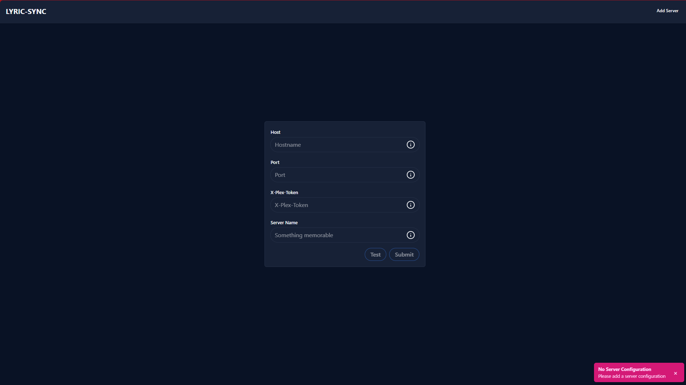
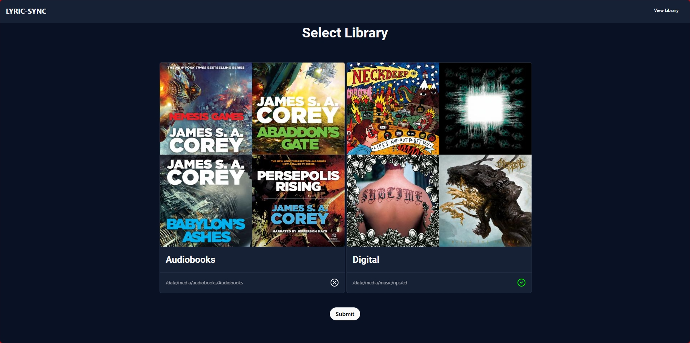
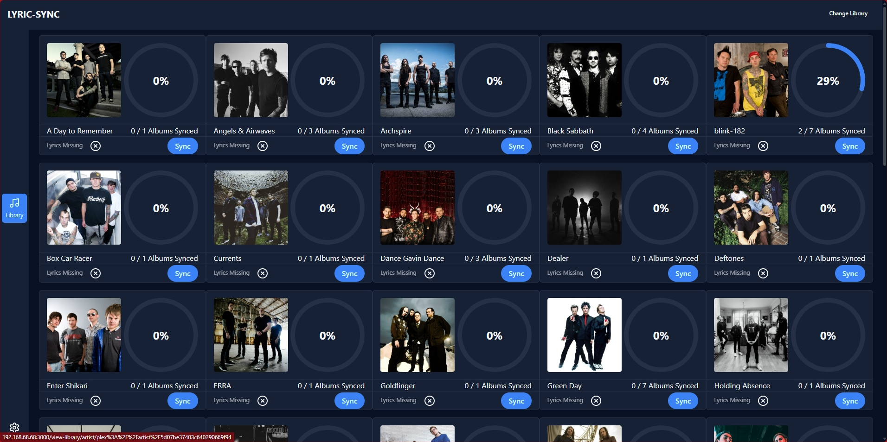
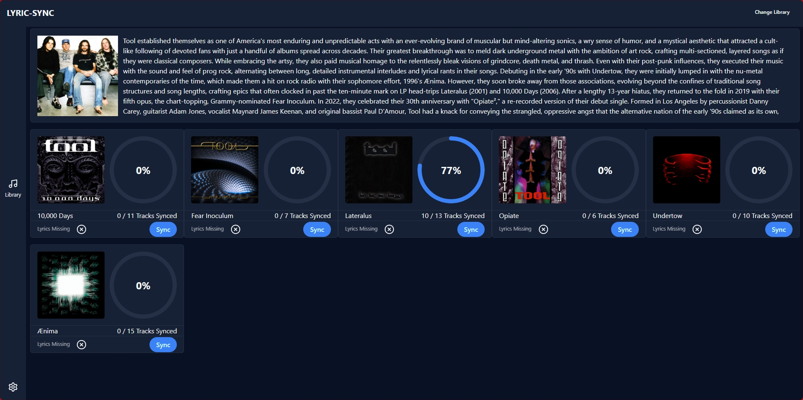
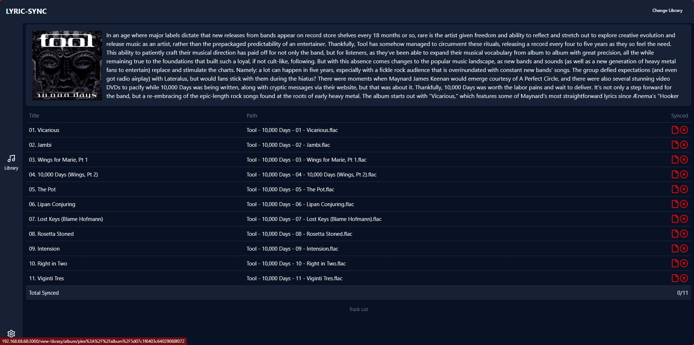
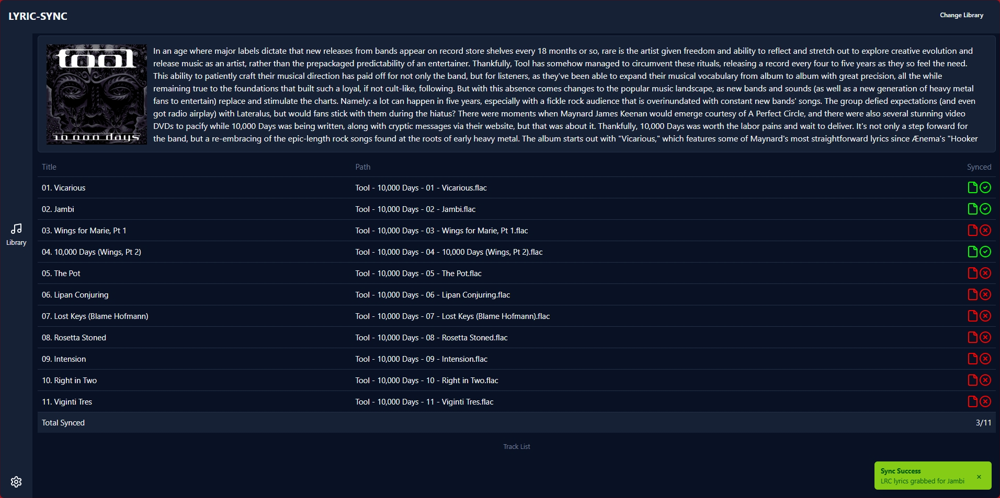

# Lyric-Sync

\


A free and open source self hosted solution for grabbing lyrics for your Plex Music Libraries.

<div align="center">
  <h2>Powered By</h2>
  <a href="https://svelte.dev/">
    
  </a>
</div>
<div align="center">
  <a href="https://www.skeleton.dev/">
    
  </a>
</div>
<div align="center">
  <a href="https://orm.drizzle.team/">
    <picture>
      <source media="(prefers-color-scheme: dark)" srcset="https://raw.githubusercontent.com/drizzle-team/drizzle-orm/refs/heads/main/misc/readme/logo-github-sq-dark.svg">
      <source media="(prefers-color-scheme: light)" srcset="https://raw.githubusercontent.com/drizzle-team/drizzle-orm/refs/heads/main/misc/readme/logo-github-sq-light.svg">
      
    </picture>
  </a>
</div>

## Inspiration

First and foremost, checkout [tranzuanthang's lrcget](https://github.com/tranxuanthang/lrcget) this was the main inspiration behind Lyric-Sync. If you're looking for an offline solution, then [lrcget](https://github.com/tranxuanthang/lrcget) is your answer.
[tranxuanthang](https://github.com/tranxuanthang) is also the individual behind [lrclib.net](https://lrclib.net/) which is currently the only lyric source that Lyric-Synce supports (more to come in the future)

## Features

v0.0.1

- Connect with your personal Plex Server
  
- Grab lyrics for multiple music libraries
  
- View all library Artists and their sync progress
  
- View all Albums by a specific artist
  
- View an Album and all of its tracks
  
- Sync individual tracks with the click of a button
  
- **Automatic Plex library synchronization** - Keeps your database in sync with Plex libraries
- **Scheduled lyrics sync** - Automatically syncs lyrics for new and failed tracks
- **Comprehensive sync options** - Manual and automated sync modes for different use cases

## Installation

### Authentication

Lyric-Sync supports optional Basic Authentication to secure your instance. To enable authentication:

1. Set both `AUTH_USERNAME` and `AUTH_PASSWORD` environment variables
2. Restart the application
3. You'll be prompted for credentials when accessing the web interface

**Important**: If you set one authentication variable, you must set both. If neither is set, authentication is disabled.

Example environment variables:
```bash
AUTH_USERNAME="admin"
AUTH_PASSWORD="your-secure-password"
```

### Docker

Docker is the recommended way to run Lyric-Sync. It just makes things easier.

Lyric-Sync must have access to your Plex Music library and the root directory must be named exactly the same. If Plex says song2 is at path `/music/artist/song2.flac`, then Lyric-Sync should see it there as well, otherwise Lyric-Sync won't be able to find music where Plex is telling it to.

Here is a sample docker-compose.yml

```yaml
services:
  lyric-sync:
    image: ghcr.io/phishbacon/lyric-sync:main
    container_name: lyric-sync
    environment:
      - ORIGIN=http://where-lyric-sync-is-running:3000
      - DATABASE_URL=file:/your-music-library/lyric-sync.db
      # Optional: Enable authentication
      # - AUTH_USERNAME=admin
      # - AUTH_PASSWORD=your-secure-password
    volumes:
      - /your-music-library:/your-music-library
    ports:
      - "3000:3000" # lyric sync runs on port 3000
    restart: unless-stopped
```

`docker-compose up -d` and you're on your way.

### Cronjob System

Lyric-Sync includes an automated cronjob system that runs in the background to keep your data synchronized:

- **Every hour**: Syncs lyrics for failed tracks and new tracks
- **Every 6 hours**: Comprehensive lyrics sync for all unsynced tracks
- **Every 12 hours**: Syncs Plex library data with the database

The cronjob system ensures that:
- New tracks added to Plex are automatically detected and synced
- Failed lyric syncs are retried with exponential backoff
- Plex library changes (new artists, albums, tracks) are reflected in the database
- Removed content is cleaned up from the database

### Library Management

When you first add a library to Lyric-Sync, the system automatically:
- Syncs library metadata from Plex
- Downloads all artists, albums, and tracks for the library
- Sets up the database structure for lyric syncing
- Begins the automated cronjob system for ongoing synchronization

You can also manually trigger syncs via the API:
- `POST /api/sync-plex` - Manually sync Plex library data
- `POST /api/sync-lyrics/sync-all` - Manually sync lyrics for a library
- `GET /api/get-latest-plex-data` - Sync content for the current library

Or the old fashioned way

```bash
# grab the latest image
docker pull ghcr.io/phishbacon/lyric-sync:main

# and run
docker run -p 3000:3000 \
  -e ORIGIN=http://where-lyric-sync-is-running:3000 \
  -e DATABASE_URL=file:/your-music-library/lyric-sync.db \
  # Optional: Enable authentication
  # -e AUTH_USERNAME=admin \
  # -e AUTH_PASSWORD=your-secure-password \
  --volume /your-music-library:/your-music-library \
  --name lyric-sync \
  -i ghcr.io/phishbacon/lyric-sync:main
```

### Building and Running Locally

You can also build Lyric-Sync yourself if you don't wish to run it in a container.

```bash
# clone this repo
git clone git@github.com:phishbacon/lyric-sync.git

# cd into the project directory
cd lyric-sync

# install dependencies
pnpm install

# copy the .env.example file and rename it to .env
cp .env.example .env

# build it
pnpm build

# start Lyric-Sync
node build
```

## Contributing

Lyric-Sync is an open source project, it is made possible with contributors like you.

The best way to start contributing to Lyric-Sync is by having access to an instance of Plex. This way, you can populate the database with real data and get real responses back from Plex.

```bash
# clone this repo
git clone git@github.com:phishbacon/lyric-sync.git

# cd into the project directory
cd lyric-sync

# install dependencies
pnpm install

# copy the .env.example file and rename it to .env
cp .env.example .env

# start the project
pnpm dev
```

## Developer Notes

Lyric-Sync is currently using [Skeleton v3 Beta](https://github.com/skeletonlabs/skeleton/discussions/2919) one issue I have noticed is that when doing an each block with cards, the first one is always sized differently than the ones that follow. My current workaround is to just add a dummy entry to the array that is being iterated over. The dummy entry has a `hide_me` key on it so we can hide the offending card.

Open an issue!
